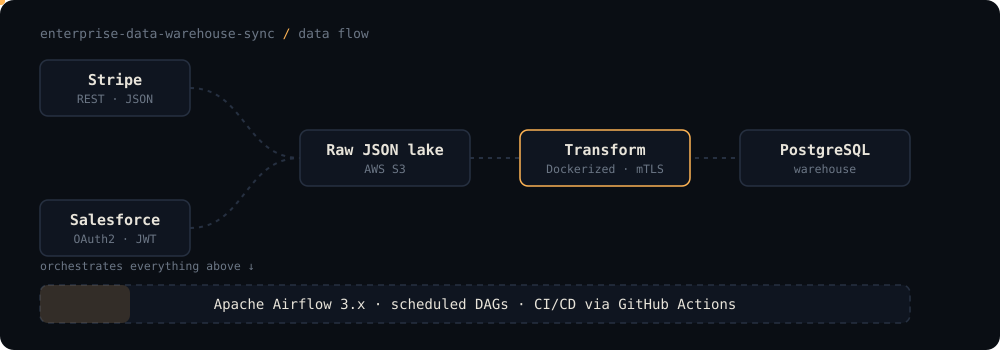
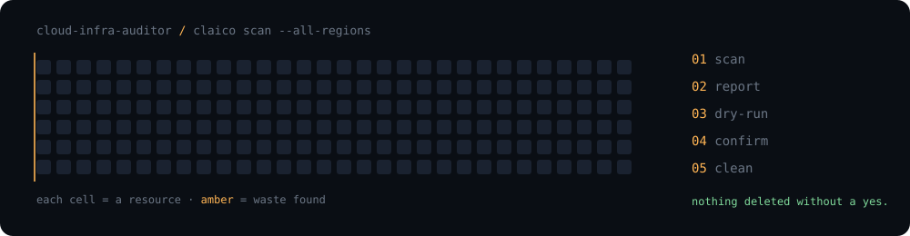
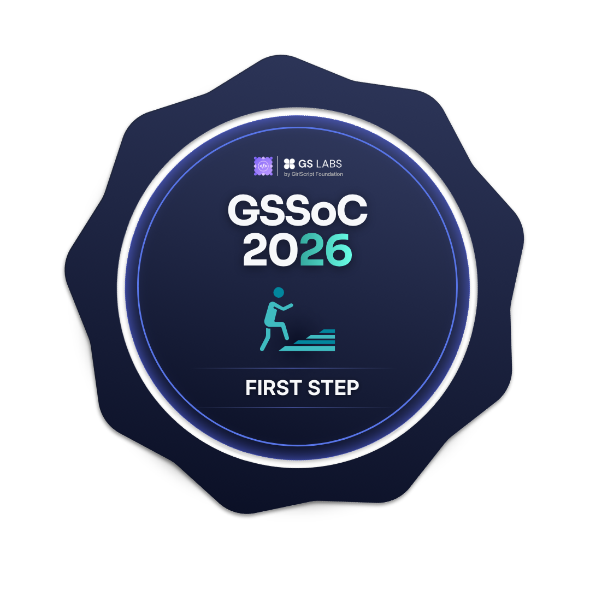
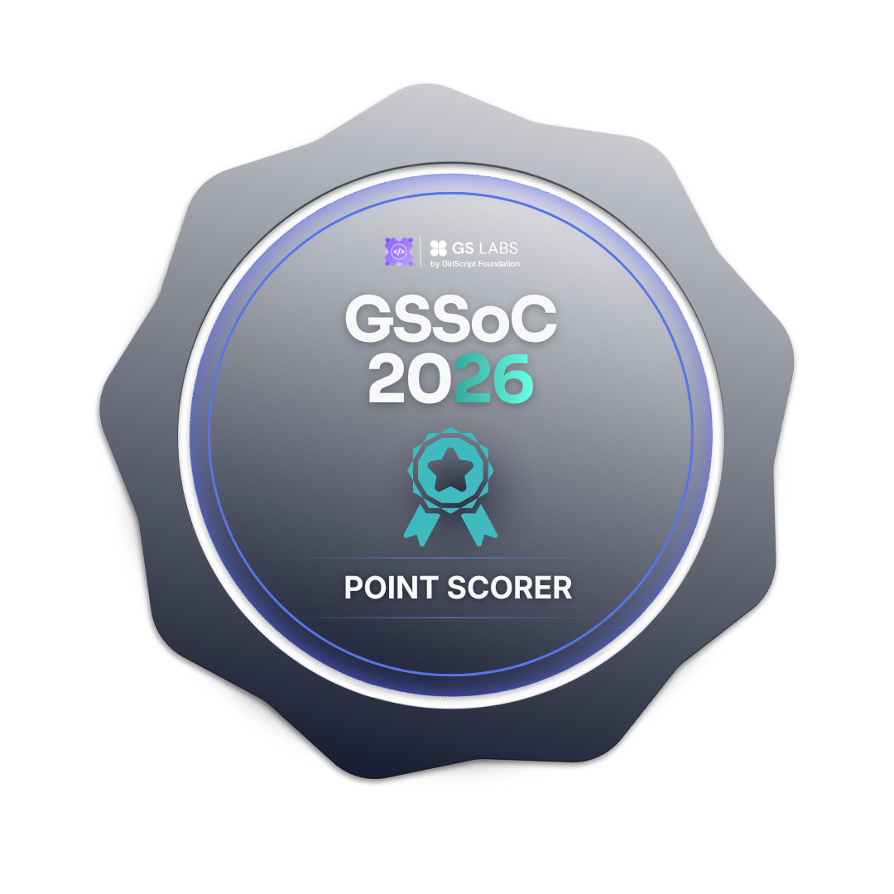
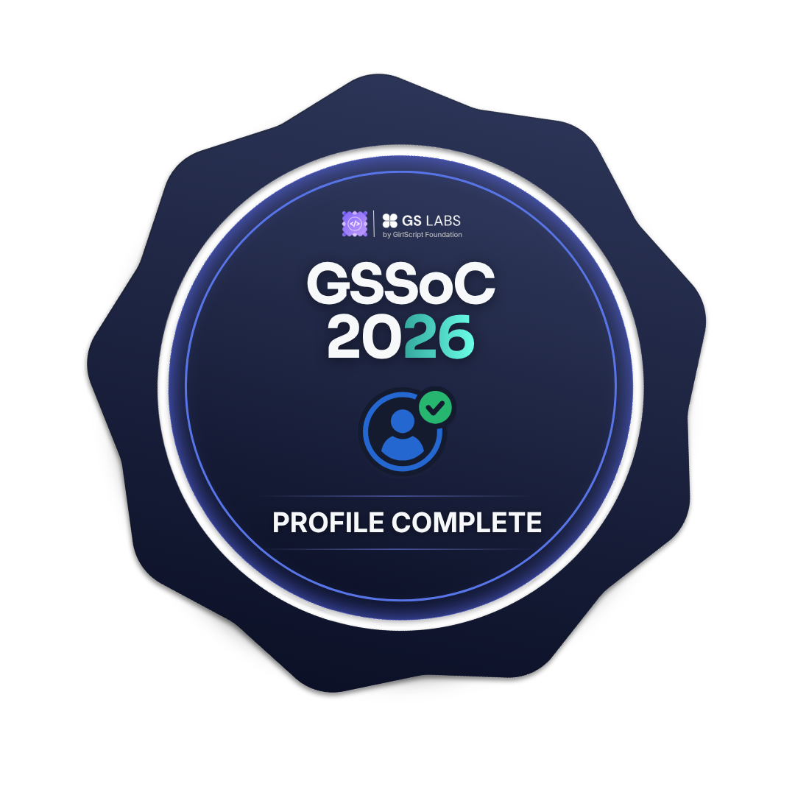

<div align="center">

  
<br>

[**now**](#now) · [**work**](#work) · [**stack**](#stack) · [**open source**](#open-source) · [**contact**](#contact)

</div>

<br>

## now

```yaml
focus:
  - distributed systems
  - data engineering
  - backend engineering
building:
  - Enterprise Data Warehouse Sync   # Stripe + Salesforce -> PostgreSQL, orchestrated by Airflow 3
  - CLAICO                           # AWS cost auditing CLI
based:    Surat, Gujarat, India
looking:  distributed systems / data / backend roles
resume:   see link in contact
```

<br>

## work

### Enterprise Data Warehouse Sync
Stripe and Salesforce data lands as raw JSON, gets transformed, and syncs into a single PostgreSQL warehouse behind a production auth layer (Salesforce JWT, mTLS between services).

<div align="center"></div>

`Python` `Airflow 3.x` `Docker` `PostgreSQL` `AWS S3` `GitHub Actions`
&nbsp;·&nbsp; Debugged a five-service Airflow 3 deployment (API server, scheduler, triggerer, DAG processor, webserver) and asyncpg dependency conflicts.
&nbsp;·&nbsp; [**repo →**](https://github.com/harshil6-lab/enterprise-data-warehouse-sync)

<br>

### CLAICO — cloud-infra-auditor
Unattached EBS volumes and idle Elastic IPs quietly inflate AWS bills. This CLI sweeps every region, reports what it finds, and only cleans up after a dry run and an explicit confirmation.

<div align="center"></div>

`Python 3.11` `Typer` `Rich` `Boto3` `Pytest` `Moto`
&nbsp;·&nbsp; Covers EC2 utilization (CloudWatch), unattached EBS, unassociated Elastic IPs, JSON/CSV reports and a Rich terminal dashboard.
&nbsp;·&nbsp; Team project with Rifaz G, Sravya M, Prakash Bhanu.
&nbsp;·&nbsp; [**repo →**](https://github.com/harshil6-lab/cloud-infra-auditor)

<br>

### Also shipped

| project | what it does | stack |
|:--|:--|:--|
| [**certifypro**](https://github.com/harshil6-lab/certifypro) | Excel sheet in, hundreds of certificates out, each verifiable via `GET /verify/{id}` | Python · FastAPI |
| **ai-resume-screening** | LLM extracts skills, rules rank candidates, n8n emails shortlist or rejection | n8n · OpenAI · Gemini · SMTP |
| **gmail-routing** | Gemini classifies each email and routes it (support, billing, spam) before you open your inbox | n8n · Gemini · Google APIs |
| **invoice-ocr** | Handles tabular, free-form and scanned invoices, appends clean rows to Google Sheets | Python · OCR · Sheets API |

<br>

## stack

<div align="center">

</div>

```text
distributed   multi-service orchestration · scheduled pipelines · mTLS service auth · containerized deployments
data          airflow · postgresql · mysql · supabase · firebase · s3 data lake
backend       python · fastapi · rest · c · c++ · smtp
infra         aws (ec2, ebs, s3) · boto3 · docker · linux · github actions · vercel
automation    n8n · openai · gemini · google apis
```

<br>

## open source

Earned through **[GirlScript Summer of Code 2026](https://gssoc.girlscript.org/)**.

<p>







</p>

<div align="center">


</div>

<br>

<picture>
  <source media="(prefers-color-scheme: dark)" srcset="https://raw.githubusercontent.com/harshil6-lab/harshil6-lab/output/github-contribution-grid-snake-dark.svg">
  
</picture>

<br>

## contact

<div align="center">

[**resume (PDF)**](https://drive.google.com/uc?export=download&id=13cSdKFxJvpLsCDuLH6LyFy4JJv_vztJ7) &nbsp;·&nbsp; [**email**](mailto:harshilkalsariya28@gmail.com) &nbsp;·&nbsp; [**linkedin**](https://linkedin.com/in/harshil-kalsariya-629651318) &nbsp;·&nbsp; [**back to top**](#)

</div>
